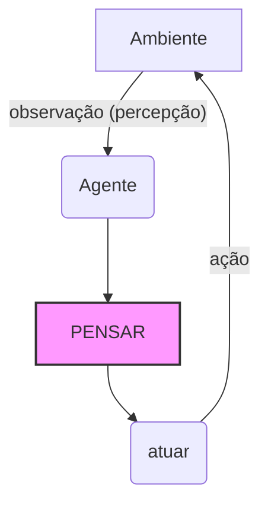

# FASE 1 - O que é um agent de IA?

Imagine um ser virtual que:

1. Percebe algo do ambiente (lê dados, recebe uma mensagem, vê o estado de um sensor);
2. Pensa ou decide com base nessa percepção (aplica uma regra, um calculo, uma politica);
3. Age no ambiente (escreve uma resposta, aciona um motor, devolve um comando);

Este ciclo é o coração  de qualquer agente de IA, do masi bobo ao mais sofisticado.

# Meu Diagrama de Agente Inteligente

Abaixo está o ciclo de interação entre o agente e o ambiente:



Este é um agente **reativo**, a forma mais simples de agente. Ele não tem memória, apenas mapeia diretamente uma entrada em uma saída. O nosso exemploserá um termostato inteligente minimalista.

Objetivo da fase:
+ Escrever o esqueleto de um agenteem Python puro.
+ Entender o loop infinito de percepção -> descisão -> ação
+ Executá-lo no terminal e interagir com ele.


## Preparando o ambiente

É necessário ter o python instalado (versão 3.9 ou superior).


## Executando e entendendo o código

1. percepcao() - No mundo real seria um sensor. Aqui é um input(). O agente "percebe" a temperatura que o utilizador digita.
2. pensar(entrada) - Aplica a regra bem simples:
    ° Frio (< 20°C) -> ligar aquecedor
    ° Quente (> 26°C) -> ligar resfriador
    ° Temperatura agradável -> manter tudo desligado
    ° Se a entrada for "sair", retorna ação de sair.
3. agir(acao) - Aqui o agente mostra no ecrã a ação decidida.No mundo real, ligada a um relé ou ligaria a uma API.
4. axecutar_agente() - É o laço eterno (até sair). Enquanto estiver vivo, o agente repete incansavelmente o ciclo.

Execute no terminal:
```
    python meu_primeiro_agente.py
```

Vá introduzindo valores como 19, 25, 27 e veja as ações mudarem. Digite sair para terminar.


## Agente 2 reativo

### seguindo o mesmo intuito do primeiro agente o segundo agente como um agente de semafaro

Quero que modifique o agente para que ele funcione como um semáforo simples (luzes de trânsito), mas que recebe do ambiente um comando do utilizador:

Se o utilizador escrever "carro", o agente deve imprimir 🚦 "Abrir sinal verde".

Se escrever "pedestre", deve imprimir 🚶 "Fechar sinal para carros, abrir para pedestres".

Se escrever "emergencia", deve imprimir 🚨 "Todos param!".

Qualquer outra coisa: "Modo normal: sinal fechado".

"sair" encerra o agente.
